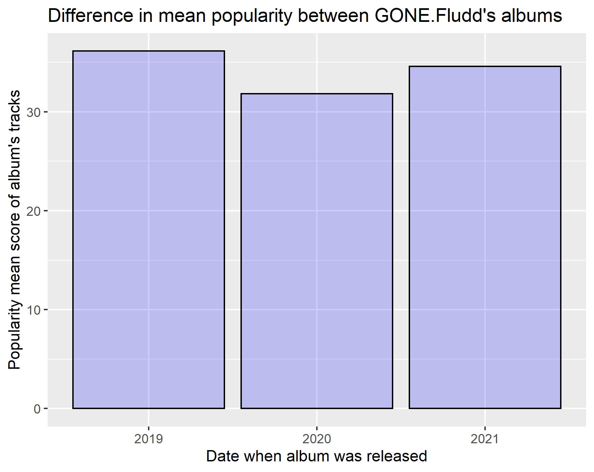
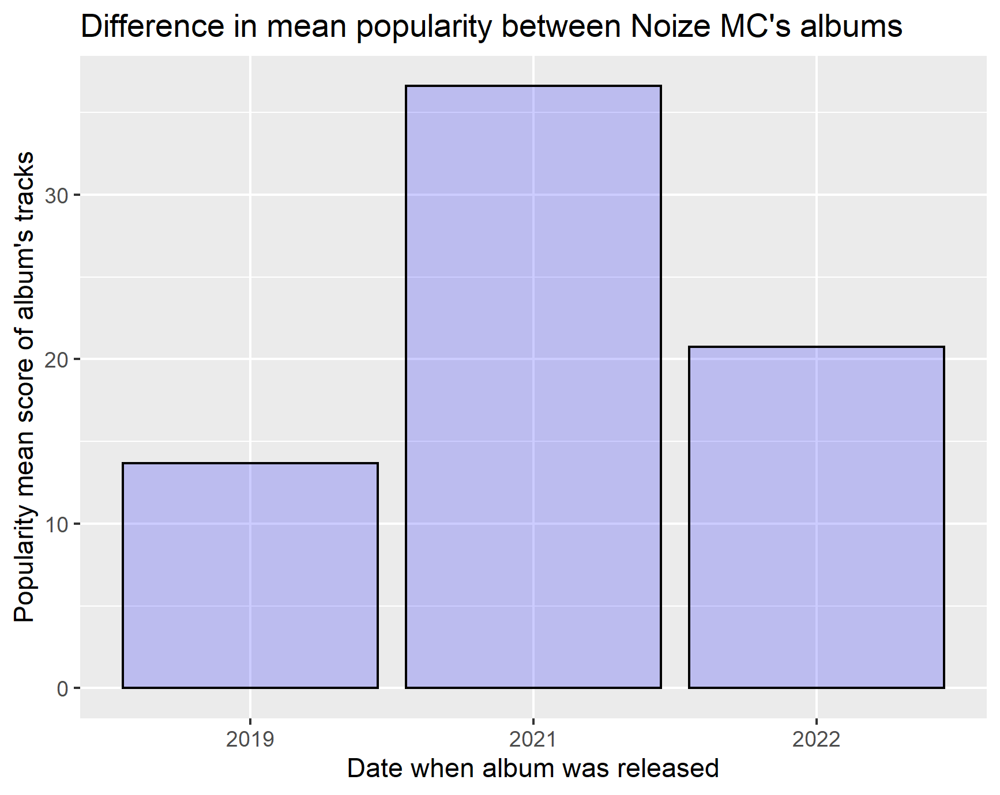
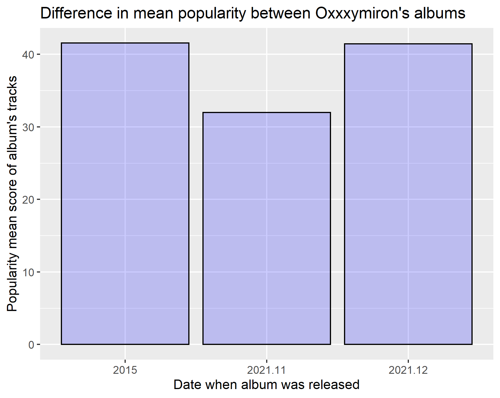

```{r setup, include=FALSE}
knitr::opts_chunk$set(echo = TRUE)
```

Link to the GitHub repository: <https://github.com/DataAccess2020/Capstone_Maletskii>\
The GitHub statistics: Number of commits: 21 . Number of pull requests: 2

## Introduction

The aim of this project was to look at the difference between popularity of Russian artist's albums released before Spotify entered the Russian market (15th of July 2020), when it was available there and after it left it (11th of April 2022). The data was collected with the help of API provided by Spotify and wrapping package "spotifyr", which facilitated the interaction with the API. Three Russian artists were chosen for the analysis: GONE.Fludd, Noize MC and Oxxxymiron.

## Overview of the workflow

To achieve the stated goal, firstly it was necessary to load the required packages and go through the process of authentication.

```{r eval=FALSE, results= "hide"}
library(tidyverse)
library(httr)
library(stringr)
library(rvest)
library(spotifyr)
library(ggplot2)


spotify_cred = rio::import(file = here::here("Credentials/spotify-credentials.xlsx"))

clientID = spotify_cred$clientID
secret =  spotify_cred$secret

response = POST(
  url = 'https://accounts.spotify.com/api/token',
  accept_json(),
  body = list(grant_type = 'client_credentials',        
              client_id = clientID,                    
              client_secret = secret, 
              content_type = "application/x-www-form-urlencoded"),   
  encode = 'form',
  verbose()
)

content = httr::content(response)
token = content$access_token

authorization_header = str_c(content$token_type, content$access_token, sep = " ")
```

Then, all the albums of the chosen Russian artists were extracted and their IDs from the links were put into a data frame with their release dates (only IDs were extracted since \*spotifyr\* requires specifically them).

```{r eval=FALSE, results= "hide"}
# first artist ----
gone.fludd.alb = get_artist_albums(
  id = "0ohUvVskERzK18bvWXFEqi",
  include_groups = c("album"),
  market = NULL,
  limit = 50,
  offset = 0,
  authorization = token,
  include_meta_info = FALSE
)


id.alb = str_remove(gone.fludd.alb$href, "https://api.spotify.com/v1/albums/")
gone.list.of.albums = as.data.frame(id.alb, gone.fludd.alb$release_date)


# second artist ----
noize.mc.alb = get_artist_albums(
  id = "69v4ZOOomf1TNp59YYB1j7",
  include_groups = c("album"),
  market = NULL,
  limit = 50,
  offset = 0,
  authorization = token,
  include_meta_info = FALSE
)


id.alb = str_remove(noize.mc.alb$href, "https://api.spotify.com/v1/albums/")
noize.list.of.albums = as.data.frame(id.alb, noize.mc.alb$release_date)

# third artist ----
oxxxymyron.alb = get_artist_albums(
  id = "1gCOYbJNUa1LBVO5rlx0jB",
  include_groups = c("album"),
  market = NULL,
  limit = 50,
  offset = 0,
  authorization = token,
  include_meta_info = FALSE
)


id.alb = str_remove(oxxxymyron.alb$href, "https://api.spotify.com/v1/albums/")
oxxxymyron.list.of.albums = as.data.frame(id.alb, oxxxymyron.alb$release_date)

```

After that, relevant albums were manually selected and for each of them the information about the tracks they contain was obtained. It is important to mention here, that Spotify's API provides information about popularity for an artist and for their tracks separately, but there is no data about popularity of an album. That is why mean popularity of tracks of each album was calculated and further used for the analysis.

```{r Getting data for GONE.Fludd, eval=FALSE, results="hide"}
# first album ----
gone.fludd.tracks21 = get_album_tracks(
  "6XuK0CMa1IYUHxlwuG0v9s",
  limit = 50,
  market = NULL,
  authorization = token,
  include_meta_info = FALSE
)


href = str_remove(gone.fludd.tracks21$href, "https://api.spotify.com/v1/tracks/")
links21 = paste(href, collapse = ",") 

info.gone.fludd.tracks21 = get_tracks(
  links21,
  market = NULL,
  authorization = token,
  include_meta_info = FALSE
)

gone.popular.21 = as.numeric(info.gone.fludd.tracks21$popularity)
mean.gone.21 = mean(gone.popular.21)

# second album ----

gone.fludd.tracks20 = get_album_tracks(
  "6QHiAIbBTeH6F4c7Rl63uq",
  limit = 50,
  market = NULL,
  authorization = token,
  include_meta_info = FALSE
)

href = str_remove(gone.fludd.tracks20$href, "https://api.spotify.com/v1/tracks/")
links20 = paste(href, collapse = ",") 

info.gone.fludd.tracks20 = get_tracks(
  links20,
  market = NULL,
  authorization = token,
  include_meta_info = FALSE
)

gone.popular.20 = as.numeric(info.gone.fludd.tracks20$popularity)
mean.gone.20 = mean(gone.popular.20)

# third album ----
gone.fludd.tracks19 = get_album_tracks(
  "3tGb1YinFuC4zD5sWiY21a",
  limit = 50,
  market = NULL,
  authorization = token,
  include_meta_info = FALSE
)

href = str_remove(gone.fludd.tracks19$href, "https://api.spotify.com/v1/tracks/")
links19 = paste(href, collapse = ",") 

info.gone.fludd.tracks19 = get_tracks(
  links19,
  market = NULL,
  authorization = token,
  include_meta_info = FALSE
)

gone.popular.19 = as.numeric(info.gone.fludd.tracks19$popularity)
mean.gone.19 = mean(gone.popular.19)


```

```{r Getting data for Noize MC, eval=FALSE, results= "hide"}
# first album ----
noize.mc.tracks22 = get_album_tracks(
  "2vP0fMWLEbwIhfxlTGreeO",
  limit = 50,
  market = NULL,
  authorization = token,
  include_meta_info = FALSE
)


href = str_remove(noize.mc.tracks22$href, "https://api.spotify.com/v1/tracks/")
links22 = paste(href, collapse = ",") 

info.noize.mc.tracks22 = get_tracks(
  links22,
  market = NULL,
  authorization = token,
  include_meta_info = FALSE
)

noize.popular.22 = as.numeric(info.noize.mc.tracks22$popularity)
mean.noize.22 = mean(noize.popular.22)

# second album ----

noize.mc.tracks21 = get_album_tracks(
  "2K9w7i2R1GckLBFCxZEdlm",
  limit = 50,
  market = NULL,
  authorization = token,
  include_meta_info = FALSE
)


href = str_remove(noize.mc.tracks21$href, "https://api.spotify.com/v1/tracks/")
links21 = paste(href, collapse = ",") 

info.noize.mc.tracks21 = get_tracks(
  links21,
  market = NULL,
  authorization = token,
  include_meta_info = FALSE
)

noize.popular.21 = as.numeric(info.noize.mc.tracks21$popularity)
mean.noize.21 = mean(noize.popular.21)

# third album ----
noize.mc.tracks19 = get_album_tracks(
  "2cvkt6qA4NHtyVvm9OW8Za",
  limit = 50,
  market = NULL,
  authorization = token,
  include_meta_info = FALSE
)


href = str_remove(noize.mc.tracks19$href, "https://api.spotify.com/v1/tracks/")
links19 = paste(href, collapse = ",") 

info.noize.mc.tracks19 = get_tracks(
  links19,
  market = NULL,
  authorization = token,
  include_meta_info = FALSE
)

noize.popular.19 = as.numeric(info.noize.mc.tracks19$popularity)
mean.noize.19 = mean(noize.popular.19)

```

```{r Getting data for Oxxxymiron, eval=FALSE, results= "hide"}
# first album ----
oxxxymiron.tracks21.12 = get_album_tracks(
  "37GqOfeuzBtpj32ZG28SqH",
  limit = 50,
  market = NULL,
  authorization = token,
  include_meta_info = FALSE
)


href = str_remove(oxxxymiron.tracks21.12$href, "https://api.spotify.com/v1/tracks/")
links21.12 = paste(href, collapse = ",") 

info.oxxxymiron.tracks21.12 = get_tracks(
  links21.12,
  market = NULL,
  authorization = token,
  include_meta_info = FALSE
)

oxxxymiron.popular.21.12 = as.numeric(info.oxxxymiron.tracks21.12$popularity)
mean.oxxxymiron.21.12 = mean(oxxxymiron.popular.21.12)

# second album ----
oxxxymiron.tracks21.11 = get_album_tracks(
  "0Nz1pnSwMM4FNRtHznneNS",
  limit = 50,
  market = NULL,
  authorization = token,
  include_meta_info = FALSE
)


href = str_remove(oxxxymiron.tracks21.11$href, "https://api.spotify.com/v1/tracks/")
links21.11 = paste(href, collapse = ",") 

info.oxxxymiron.tracks21.11 = get_tracks(
  links21.11,
  market = NULL,
  authorization = token,
  include_meta_info = FALSE
)

oxxxymiron.popular.21.11 = as.numeric(info.oxxxymiron.tracks21.11$popularity)
mean.oxxxymiron.21.11 = mean(oxxxymiron.popular.21.11)

# third album ----
oxxxymiron.tracks15 = get_album_tracks(
  "3ewRuYOSneUjBqbVQn45Jy",
  limit = 50,
  market = NULL,
  authorization = token,
  include_meta_info = FALSE
)


href = str_remove(oxxxymiron.tracks15$href, "https://api.spotify.com/v1/tracks/")
links15 = paste(href, collapse = ",") 

info.oxxxymiron.tracks15 = get_tracks(
  links15,
  market = NULL,
  authorization = token,
  include_meta_info = FALSE
)

oxxxymiron.popular.15 = as.numeric(info.oxxxymiron.tracks15$popularity)
mean.oxxxymiron.15 = mean(oxxxymiron.popular.15)

```

Finally, the flowing code was used to visualize obtained data for further analysis.

```{r eval=FALSE, results= "hide"}
#plot for the first artist----
gone.frame = data.frame(
  mean_pop = c(mean.gone.19, mean.gone.20, mean.gone.21),
  date_real = c("2019", "2020", "2021")
)

gone.fludd.plot = ggplot(gone.frame, aes(x = date_real, y = mean_pop)) + 
geom_col(alpha = 0.2, col = "black", fill = "blue") +
  ylab("Popularity mean score of album's tracks") +
  xlab("Date when album was released") +
  ggtitle("Difference in mean popularity between GONE.Fludd's albums")
ggsave("gone.fludd.plot.png", path = "Figures")

#plot for the second artist----
noize.frame = data.frame(
  mean_pop = c(mean.noize.19, mean.noize.21, mean.noize.22),
  date_real = c("2019", "2021", "2022")
)

noize.mc.plot = ggplot(noize.frame, aes(x = date_real, y = mean_pop)) + 
  geom_col(alpha = 0.2, col = "black", fill = "blue") +
  ylab("Popularity mean score of album's tracks") +
  xlab("Date when album was released") +
  ggtitle("Difference in mean popularity between Noize MC's albums")
ggsave("noize.mc.plot.png", path = "Figures")

#plot for the third artist----
oxxxymiron.frame = data.frame(
  mean_pop = c(mean.oxxxymiron.15, mean.oxxxymiron.21.11, mean.oxxxymiron.21.12),
  date_real = c("2015", "2021.11", "2021.12")
)

oxxxymiron.plot = ggplot(oxxxymiron.frame, aes(x = date_real, y = mean_pop)) + 
  geom_col(alpha = 0.2, col = "black", fill = "blue") +
  ylab("Popularity mean score of album's tracks") +
  xlab("Date when album was released") +
  ggtitle("Difference in mean popularity between Oxxxymiron's albums")
ggsave("oxxxymiron.plot.png", path = "Figures")
```

## Results

As can be seen from the bar charts, Noize MC's album released when Spotify was available in Russia has significantly higher mean popularity comparing to those, released before and after that. However, the difference in mean popularity of albums for two other artists does not have the same pattern. Therefore we cannot state that there is an influence of presence of Spotify on Russian market on popularity of Russian artists' albums.

\

\

\

## Conclusion

Unfortunately, the results didn't show any strong relationship between the availability of Spotify in Russia and popularity of Russian artists' albums. The reason for that may be the fact that Spotify's API provides information only about current popularity and it is impossible to look in the past and compare popularity near the release dates of the albums.

Nevertheless, I am inclined to believe that this project was not done in vain. Since the API does not have popularity index for artists albums, the code that was written here (with minor changes, like adding for loops) can be further used to create an app that gets mean popularity of tracks in albums and then compare them to show the most and the least popular albums of any artist.
